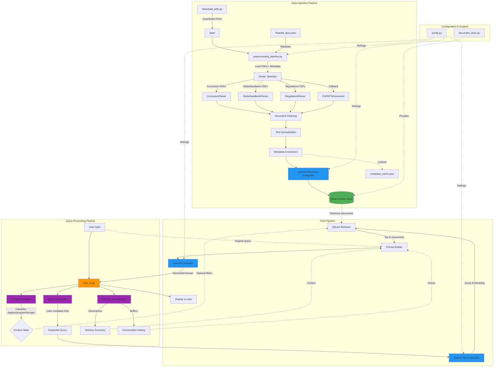
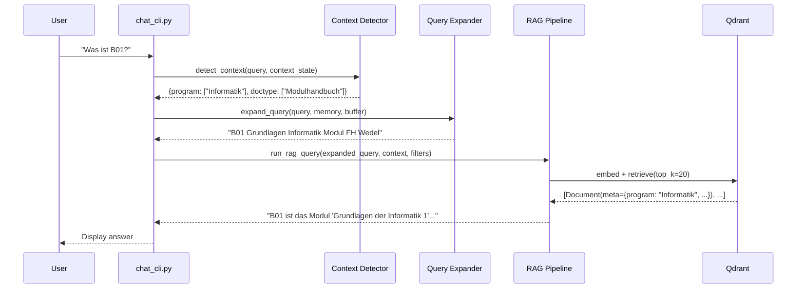
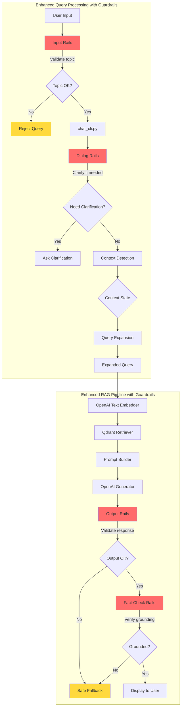

# Workshop: Aktuelle Themen der Informatik - WS25/26

## Quick Start with Docker

The entire application stack can be run with Docker Compose:

```bash
# Start all services (Frontend, RAG API, MongoDB, Qdrant)
docker compose up frontend -d

# View logs
docker compose logs -f frontend

# Stop all services
docker compose down
```

**Services:**
- Frontend (Next.js): http://localhost:3000
- RAG API (FastAPI): http://localhost:8000
- MongoDB: localhost:27017
- Qdrant: http://localhost:6333

**Features:**
- Hot reload enabled for both frontend and backend
- Persistent data storage with Docker volumes
- Automatic service dependencies and health checks

## Architecture Overview

This project implements a RAG (Retrieval-Augmented Generation) chatbot for FH Wedel using Haystack, OpenAI embeddings, and Qdrant vector database.



### Component Descriptions

#### Data Ingestion Components
- **download_pdfs.py**: Downloads study documents from FH Wedel website
- **preprocessing_pipeline.py**: Loads PDFs and metadata, prepares sources
- **Parsers**: Specialized parsers for different document types
  - `CurriculumParser`: Parses study plan documents
  - `ModulhandbuchParser`: Parses module handbooks
  - `RegulationsParser`: Parses study and exam regulations
  - `BaseParser`: Abstract base class for all parsers
- **indexing_pipeline.py**: Orchestrates the full ingestion pipeline
- **metadata_collector.py**: Collects and aggregates metadata from all documents

#### Query Processing Components
- **chat_cli.py**: Interactive command-line chat interface
- **context_detection.py**: LLM-based context classifier (degree, program, doctype, status)
- **query_expansion.py**: Expands queries with synonyms and metadata hints
- **memory_utils.py**: Manages conversation memory and summarization

#### RAG Pipeline Components
- **rag_pipeline.py**: Haystack pipeline with:
  - `OpenAITextEmbedder`: Converts queries to embeddings
  - `QdrantEmbeddingRetriever`: Retrieves relevant documents
  - `PromptBuilder`: Constructs prompts with context
  - `OpenAIGenerator`: Generates final answers

#### Storage & Configuration
- **document_store.py**: Qdrant vector database interface
- **config.py**: Central configuration (models, paths, parameters)
- **Qdrant**: Vector database for semantic search

---

## Data Models

### Document Model

Documents in the system use the Haystack `Document` dataclass structure:

```python
Document(
    id: str,                    # Unique document identifier
    content: str,               # Text content (enriched with metadata)
    embedding: List[float],     # 1536-dimensional vector (text-embedding-qwen3)
    meta: Dict[str, Any]        # Metadata payload (see below)
)
```

### Metadata Schema

Each document contains rich metadata for filtering and context:

```python
{
    # Core Metadata (from fhwedel_docs.json)
    "filename": str,           # Original PDF filename
    "degree": str,             # "Bachelor" | "Master"
    "program": str,            # e.g., "Informatik", "Smart Technology"
    "doctype": str,            # "Modulhandbuch" | "Studien- und Prüfungsordnung" |
                              #  "Studienverlaufsplan" | "Modulübersicht"
    "status": str,             # "aktuell" | "archiviert"
    "version": str,            # e.g., "B_INF23.0", "M_ST24.2"
    "url": str,                # Source URL on FH Wedel website

    # Parser-Extracted Metadata (varies by doctype)
    "module_id": str,          # e.g., "B01", "WI-M1" (from Modulhandbuch)
    "module_name": str,        # e.g., "Grundlagen der Informatik 1"
    "ects": int,               # Credit points
    "semester": int,           # Recommended semester (1-7)
    "track": str,              # Study track/specialization
    "sws": float,              # Semesterwochenstunden
    "page": int,               # Source page number in PDF

    # Additional Enrichment
    "chunk_id": int,           # Chunk number for long documents
    "section": str             # Section title/heading
}
```

### Content Enrichment

Before embedding, document content is enriched with metadata prefix:

```
Degree: Bachelor | Program: Smart Technology | DocType: Modulhandbuch | Status: aktuell | Version: B_ST23.0

[Original document content with normalized abbreviations]
- ECTS → ECTS (European Credit Transfer System)
- SWS → Semesterwochenstunden (SWS)
- K1/K2 → Klausur (K1/K2)
- PF → Portfolio-Prüfung (PF)
```

This improves semantic search by making metadata queryable through embeddings.

### Context State Model

The conversation context tracker maintains:

```python
context_state = {
    "degree": List[str],       # ["Bachelor"] or ["Master"] or both
    "program": List[str],      # ["Informatik", "Smart Technology"]
    "doctype": List[str],      # ["Modulhandbuch"]
    "status": List[str]        # ["aktuell"]
}
```

**Context Update Rules:**
- `degree` and `status`: Union merge (accumulates across conversation)
- `program` and `doctype`: Override merge (replaces on new detection)
- LLM-based classification with keyword fallbacks

### Memory Models

#### Conversation Buffer
```python
conversation_buffer: Deque[Tuple[str, str]] = deque(maxlen=MAX_MEMORY_TURNS)
# Example: [("user", "Was ist B01?"), ("assistant", "B01 ist...")]
```

#### Memory Summary
```python
memory_summary: str  # LLM-generated summary of conversation history
# Condensed when buffer exceeds MAX_MEMORY_TURNS (default: 5)
```

### Qdrant Storage Model

Documents are stored in Qdrant with this structure:

```python
{
    "id": "uuid-v4",                     # Document ID
    "vector": [0.123, -0.456, ...],      # 1536-dim embedding
    "payload": {
        # All metadata fields above
        "content": str,                  # Enriched text content
        "degree": str,
        "program": str,
        # ... (full metadata schema)
    }
}
```

**Index Configuration:**
- Collection: `documents`
- Distance Metric: Cosine similarity
- Dimension: 1536 (text-embedding-qwen3-0.6b)
- Storage: Local filesystem (`qdrant_data/`)

### Metadata Cache Model

Aggregated metadata is cached for query expansion:

```json
{
    "degree": ["Bachelor", "Master"],
    "program": ["Informatik", "Smart Technology", "..."],
    "module_id": ["B01", "B02", "WI-M1", "..."],
    "module_name": ["Grundlagen der Informatik 1", "..."],
    "doctype": ["Modulhandbuch", "Studien- und Prüfungsordnung", "..."],
    "semester": ["1", "2", "3", "..."],
    "status": ["aktuell", "archiviert"]
}
```

Stored in `metadata_cache.json` and used by:
- **Query Expansion**: Adds relevant module IDs/names to queries
- **Context Detection**: Validates LLM-extracted entities

### Query Flow Data



---

## Nemo Guardrails Integration Approach

### Overview

**Yes, Nemo Guardrails can be integrated with this Haystack-based RAG architecture.** Nemo Guardrails (by NVIDIA) is a toolkit for adding programmable guardrails to LLM-based conversational systems, providing control over input validation, output filtering, dialog management, and fact-checking.

### Why It's Compatible

The current architecture already separates concerns into distinct components (context detection, query processing, RAG pipeline, response generation), making it straightforward to inject guardrails at multiple points without major refactoring. Nemo Guardrails operates as middleware that can wrap existing LLM calls or act as a standalone validation layer.

### Key Integration Points

#### 1. Input Rails (User Query Validation)
**Location:** `chat_cli.py:64` (before context detection)

**Purpose:**
- Validate that user queries are related to FH Wedel study programs
- Block off-topic questions (e.g., "What's the weather?", "Tell me a joke")
- Prevent jailbreak attempts or prompt injection
- Ensure queries are appropriately scoped

**Implementation:**
```python
# In chat_cli.py, add before context detection
from nemoguardrails import RailsConfig, LLMRails

# Initialize guardrails (once during startup)
config = RailsConfig.from_path("./config/guardrails")
rails = LLMRails(config)

# In chat loop, validate input
validation_result = rails.check_input(query)
if validation_result.is_blocked:
    print(f"⚠️ {validation_result.message}")
    continue
```

**Guardrail Configuration (Colang DSL):**
```yaml
# config/guardrails/config.yml
models:
  - type: main
    engine: openai
    model: gpt-4

rails:
  input:
    flows:
      - check topic relevance
      - check offensive content
```

```colang
# config/guardrails/input_rails.co
define user ask off topic
  "What's the weather?"
  "Tell me a joke"
  "Who won the football game?"

define flow check topic relevance
  user ask off topic
  bot inform off topic
    "I can only answer questions about FH Wedel study programs, modules, and regulations."
```

#### 2. Output Rails (Response Validation)
**Location:** `rag_pipeline.py:140` (after OpenAI generator)

**Purpose:**
- Ensure responses don't contain hallucinated information
- Validate that answers reference retrieved documents
- Filter out inappropriate or uncertain responses
- Check for PII leakage from training data

**Implementation:**
```python
# In rag_pipeline.py, wrap the generator output
def run_rag_query(...) -> str:
    # ... existing code ...

    result = pipeline.run(inputs)
    replies = result["generator"]["replies"]
    if not replies:
        return "No reply: I don't know."

    raw_response = replies[0].strip()

    # Validate output with guardrails
    validated_response = rails.check_output(
        raw_response,
        context={
            "retrieved_documents": result["retriever"]["documents"],
            "query": original_query
        }
    )

    if validated_response.is_blocked:
        return "I apologize, but I cannot provide a confident answer based on the available documents."

    return validated_response.text
```

**Guardrail Configuration:**
```colang
# config/guardrails/output_rails.co
define bot response uncertain
  "I think..."
  "Maybe..."
  "I'm not sure, but..."

define bot response hallucination
  # Detect responses not grounded in retrieved docs
  # Custom Python action for semantic similarity check

define flow check output quality
  bot response uncertain
  bot inform uncertainty
    "I don't have enough information to answer that confidently."

define flow check factual grounding
  bot response hallucination
  bot refuse ungrounded
    "I can only answer based on official FH Wedel documents."
```

#### 3. Dialog Rails (Conversation Flow Management)
**Location:** Replaces/augments `memory_utils.py` and `context_detection.py`

**Purpose:**
- Manage multi-turn conversations with state
- Handle clarification questions (e.g., "Which program?", "Bachelor or Master?")
- Guide users through complex queries
- Maintain conversation coherence

**Implementation:**
```python
# New file: guardrails_dialog.py
from nemoguardrails import LLMRails

class GuardrailsDialogManager:
    def __init__(self, rails: LLMRails):
        self.rails = rails
        self.conversation_id = None

    def process_turn(self, user_message: str, context_state: dict) -> dict:
        """
        Process a conversation turn with guardrails dialog management.
        Returns: {
            "should_clarify": bool,
            "clarification_question": str,
            "processed_query": str,
            "updated_context": dict
        }
        """
        response = self.rails.generate(
            messages=[{"role": "user", "content": user_message}],
            context=context_state
        )
        return response
```

**Guardrail Configuration:**
```colang
# config/guardrails/dialog_rails.co
define flow clarify program
  user ask about module
  if $program is None
    bot ask program
      "Which study program are you interested in? (e.g., Informatik, Smart Technology)"
    user provide program
    $program = user provided program

define flow clarify degree
  user ask about curriculum
  if $degree is None
    bot ask degree
      "Are you asking about Bachelor or Master programs?"
    user provide degree
    $degree = user provided degree

define user ask about module
  "Tell me about B01"
  "What is module WI-M1?"
  "Explain module {module_id}"

define user provide program
  "Informatik"
  "Smart Technology"
  "Computer Science"
```

#### 4. Fact-Checking Rails (Hallucination Prevention)
**Location:** Post-processing step in `rag_pipeline.py`

**Purpose:**
- Verify LLM responses against retrieved documents
- Check semantic entailment (answer must be supported by context)
- Flag low-confidence or speculative answers
- Implement "self-check" prompting

**Implementation:**
```python
# In rag_pipeline.py, add fact-checking component
from nemoguardrails.actions import action

@action(is_system_action=True)
def check_factual_consistency(context: dict) -> bool:
    """
    Custom action to verify response is grounded in retrieved documents.
    Uses semantic similarity between response and document chunks.
    """
    from sentence_transformers import SentenceTransformer

    model = SentenceTransformer('all-MiniLM-L6-v2')

    response_embedding = model.encode(context["bot_message"])
    doc_embeddings = model.encode([
        doc.content for doc in context["retrieved_documents"]
    ])

    # Calculate max similarity
    from sklearn.metrics.pairwise import cosine_similarity
    similarities = cosine_similarity([response_embedding], doc_embeddings)[0]
    max_similarity = max(similarities)

    # Threshold for factual grounding
    return max_similarity > 0.7

# Guardrail flow
define flow verify factual grounding
  bot provide answer
  $is_grounded = check_factual_consistency()
  if not $is_grounded
    bot refuse ungrounded answer
      "I cannot verify this answer against the official documents. Please ask more specifically."
```

### Integration Architecture



### Configuration Structure

```
rag-code/
├── config/
│   └── guardrails/
│       ├── config.yml              # Main guardrails config
│       ├── input_rails.co          # Input validation flows
│       ├── output_rails.co         # Output validation flows
│       ├── dialog_rails.co         # Conversation management
│       ├── actions.py              # Custom Python actions
│       └── kb/                     # Knowledge base for guardrails
│           └── fhwedel_topics.md   # Allowed topics/entities
├── guardrails_wrapper.py           # Guardrails integration layer
├── chat_cli.py                     # Modified with guardrails
└── rag_pipeline.py                 # Modified with output rails
```

### Implementation Steps

1. **Install Nemo Guardrails:**
```bash
pip install nemoguardrails
```

2. **Create Configuration Files:**
   - Define allowed topics based on `metadata_cache.json`
   - Write Colang flows for input/output validation
   - Configure dialog management for clarification questions

3. **Integrate Input Rails:**
   - Modify `chat_cli.py` to validate queries before processing
   - Add topic validation using study program metadata

4. **Integrate Output Rails:**
   - Wrap `OpenAIGenerator` responses in `rag_pipeline.py`
   - Add fact-checking against retrieved documents

5. **Add Custom Actions:**
   - Implement semantic similarity checker for hallucination detection
   - Create metadata-aware validators (e.g., valid module IDs)

6. **Test & Tune:**
   - Test with off-topic queries
   - Verify clarification flows work correctly
   - Tune similarity thresholds for fact-checking

### Benefits for FH Wedel RAG Chatbot

1. **Topic Enforcement:**
   - Ensures chatbot only answers questions about FH Wedel study programs
   - Prevents resource waste on irrelevant queries

2. **Hallucination Prevention:**
   - Validates responses are grounded in retrieved documents
   - Reduces risk of providing incorrect module information

3. **Improved User Experience:**
   - Guides users through complex queries with clarifications
   - Provides helpful error messages for out-of-scope questions

4. **Safety & Compliance:**
   - Prevents sensitive information leakage
   - Blocks inappropriate or offensive queries
   - Maintains professional tone in responses

5. **Monitoring & Debugging:**
   - Logs all blocked queries for analysis
   - Identifies common clarification needs
   - Tracks conversation flow patterns

### Alternative: Lightweight Custom Guardrails

If Nemo Guardrails adds too much overhead, a lightweight custom implementation is also possible:

```python
# guardrails_lite.py
from typing import List, Tuple
from sentence_transformers import SentenceTransformer
from sklearn.metrics.pairwise import cosine_similarity
import json

class LightweightGuardrails:
    def __init__(self, metadata_cache_path: str):
        self.model = SentenceTransformer('all-MiniLM-L6-v2')
        with open(metadata_cache_path) as f:
            self.allowed_entities = json.load(f)

        # Precompute topic embeddings
        self.topic_keywords = [
            "FH Wedel", "Studiengang", "Modul", "ECTS", "Prüfung",
            "Semester", "Informatik", "Smart Technology", "Curriculum"
        ]
        self.topic_embeddings = self.model.encode(self.topic_keywords)

    def validate_input(self, query: str) -> Tuple[bool, str]:
        """Check if query is on-topic."""
        query_embedding = self.model.encode([query])
        similarities = cosine_similarity(query_embedding, self.topic_embeddings)[0]

        if max(similarities) < 0.3:  # Threshold
            return False, "Please ask questions about FH Wedel study programs."
        return True, ""

    def validate_output(self, response: str, documents: List) -> Tuple[bool, str]:
        """Check if response is grounded in documents."""
        if not documents:
            return True, ""  # No docs to validate against

        response_emb = self.model.encode([response])
        doc_embs = self.model.encode([d.content for d in documents[:5]])

        similarities = cosine_similarity(response_emb, doc_embs)[0]

        if max(similarities) < 0.5:  # Threshold
            return False, "Cannot verify answer against official documents."
        return True, ""
```

### Recommendation

For production deployment, **use full Nemo Guardrails** for its mature dialog management and extensive testing. For prototyping or resource-constrained environments, start with **lightweight custom guardrails** focusing on input topic validation and output fact-checking.
